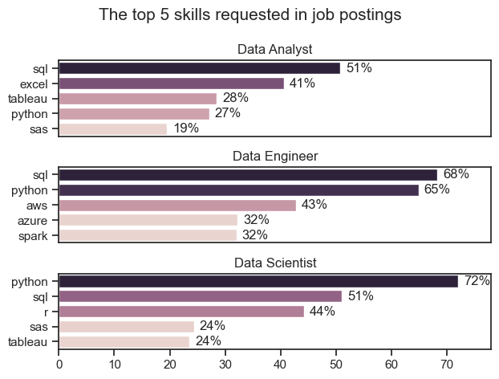
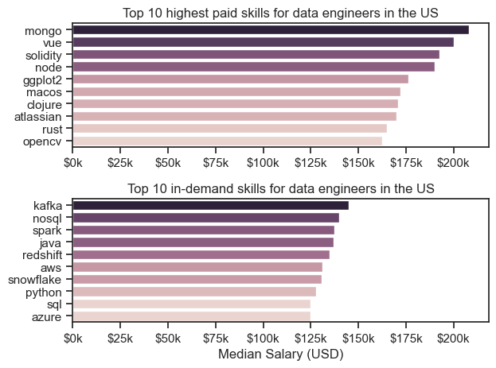
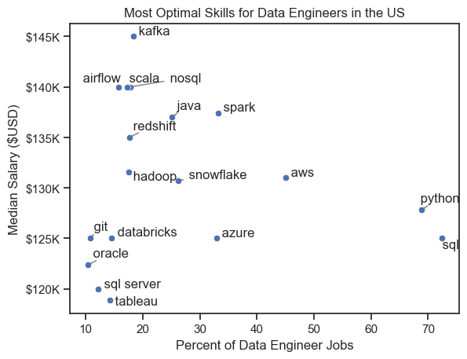

# Overview

This analysis focuses on the U.S. data job market, specifically examining data engineering roles. The project was created to better understand and navigate the job landscape. It highlights top-paying and in-demand skills to identify the best opportunities for data engineers aiming for career growth.

The data sourced from [Luke Barousse's Python Course](https://lukebarousse.com/python) which provides a foundation for my analysis, containing detailed information on job titles, salaries, locations, and essential skills.

# The Questions

Below are the questions I want to answer in my project:

1. What are the skills most in demand for the top 3 most popular data roles ?
2. How are in-demand skills trending for Data Engineers ?
3. How well do jobs and skills pay for Data Engineers ?
4. What are the optimal skills for data engineers to learn ? (High Demand and High Paying) 

# Tools I Used

- **Pandas Library**
- **Matplotlib Library** 
- **Seaborn Library**
- **Jupyter Notebook (inside VS Code)** 
- **Git & GitHub**

# Data Preparation and Cleanup

This section outlines the steps taken to prepare the data for analysis, ensuring accuracy and usability.

## Import & Clean Up Data

I start by importing necessary libraries and loading the dataset, followed by initial data cleaning tasks to ensure data quality.

```python
# Importing libs
import pandas as pd
import ast
from datasets import load_dataset
import matplotlib.pyplot as plt
import seaborn as sns

# Loading data
dataset=load_dataset('lukebarousse/data_jobs')
df = dataset['train'].to_pandas()

# Data cleanup
df['job_posted_date']=pd.to_datetime(df.job_posted_date)
df['job_skills']=df.job_skills.apply(lambda skill_list: ast.literal_eval(skill_list) if pd.notna(skill_list) else skill_list)
```

## Filter US Jobs

To focus my analysis on the U.S. job market, I applied this filter to the dataset, narrowing down to roles based in the United States.

```python
# Filter for the US country
df_US=df[df['job_country'] == 'United States'].copy()
```

# The Analysis

Each section of the jupyter notebook for this project aimed at investigating specific aspects of the data job market. Here’s the answer of each question:

## 1. What are the most demanded skills for the top 3 most popular data roles ?




### Insights:

- SQL is the most sought-after skill among all three roles, featured in 68% of Data Engineer job postings and 51% for Data Analysts and Data Scientists.
- Data Engineers need more specialized technical expertise, such as AWS, Azure, and Spark, while Data Analysts and Data Scientists are expected to be skilled in broader data management and analysis tools like Excel and Tableau.
- Python is a highly valued skill across all three positions, with the greatest demand for Data Scientists (72%).

## 2. How are in-demand skills trending for Data Engineers ?


### Insights:


## 3. How well do jobs and skills pay for Data Engineers ?

  

#### Insights

- There's a significant variation in salary ranges across different job titles. Data Scientist positions tend to have the highest salary potential, with up to $600K, indicating the high value placed on advanced data skills and experience in the industry.

- Senior Data Engineer and Senior Data Scientist roles show a considerable number of outliers on the higher end of the salary spectrum, suggesting that exceptional skills or circumstances can lead to high pay in these roles. In contrast, Data Analyst roles demonstrate more consistency in salary, with fewer outliers.

- The median salaries increase with the seniority and specialization of the roles. Senior roles (Senior Data Scientist, Senior Data Engineer) not only have higher median salaries but also larger differences in typical salaries, reflecting greater variance in compensation as responsibilities increase.

### Highest Paid & Most Demanded Skills for Data Engineers

Next, I narrowed my analysis and focused only on data engineer roles. I looked at the highest-paid skills and the most in-demand skills. I used two bar charts to showcase these.

#### Results



#### Insights:

- The top graph shows specialized technical skills like `mongo`, `vue`, and `solidity` are associated with higher salaries, some reaching up to $200K, suggesting that advanced technical proficiency can increase earning potential.

- The bottom graph highlights that foundational skills like `Kafka`, `NoSQL`, and `Spark` are the most in-demand, even though they may not offer the highest salaries. This demonstrates the importance of these core skills for employability in data engineering roles.

- There's a clear distinction between the skills that are highest paid and those that are most in-demand. Data Engineers aiming to maximize their career potential should consider developing a diverse skill set that includes both high-paying specialized skills and widely demanded foundational skills.

## 4. What are the most optimal skills to learn for Data Engineers ?

    

#### Insights:


# Project Insights

This project offered valuable insights into the data engineering job market:

- **Skill Demand and Salary Correlation**: There is a clear correlation between the demand for specific skills and the salaries these skills command. Advanced and specialized skills like Kafka often lead to higher salaries.
- **Market Trends**: The evolving demand for specific skills underscores the dynamic nature of the data job market, making it essential for data engineers to stay updated to foster career growth.
- **Economic Value of Skills**: Identifying which skills are both in high demand and well-compensated can help data engineers prioritize learning to maximize their economic potential.


# Challenges I Faced

This project presented several challenges, each offering valuable learning opportunities:

- **Data Inconsistencies**: Addressing missing or inconsistent data entries required thoughtful data-cleaning strategies to maintain the accuracy and reliability of the analysis.
- **Complex Data Visualization**: Crafting clear and impactful visualizations of complex datasets proved challenging but was essential for effectively communicating key insights.
- **Balancing Breadth and Depth**: Striking the right balance between in-depth analysis and maintaining a broad perspective was crucial to provide thorough coverage without getting bogged down in excessive detail.


# Conclusion

This analysis of the US data engineer job market has offered valuable insights into the key skills and trends driving the field. It provides a solid foundation for anyone seeking to grow in data engineering and highlights the importance of continuous learning and adaptation. As the industry evolves, ongoing analysis will be crucial for staying competitive and informed.


